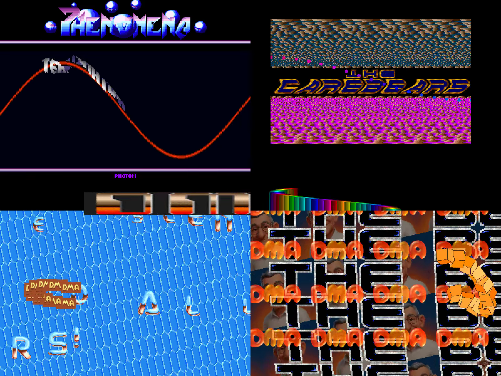
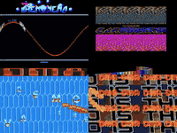

# Multiscreen Mega Demo

Go/Ebitengine remake of the original DMA multiscreen mega demo.

<!-- Project showcase -->
## Screenshots

[](docs/media/screenshot-1.png)

Four demos running together: Phenomena, TCB, Viva TCB, and Coco Is The Best.

## Video

[](https://github.com/olivierh59500/go-multiscreen/raw/refs/heads/main/docs/media/preview.mp4)

**[Watch or download the 24-second MP4 preview with sound](https://github.com/olivierh59500/go-multiscreen/raw/refs/heads/main/docs/media/preview.mp4)**

This short showcase combines selected passages from the Go production.

The animated image is silent; the MP4 includes the soundtrack.

<!-- End project showcase -->

## Desktop

```sh
go run ./cmd/multiscreen
```

## Android

The Android launcher runs in immersive sensor-landscape mode. The fixed
800x600 canvas is scaled by Ebitengine to fit the device display.

Requirements: Go 1.25 or later, Android SDK/API 36, Android NDK, JDK 17,
and USB debugging enabled on an authorized device. The matching `ebitenmobile`
version is pinned by `go.mod` and invoked through `go tool`.

Build, install, and launch on the connected device:

```sh
./scripts/run-android.sh
```

The script detects the connected device ABI and builds only that native
library. This keeps local install APKs small (for example, ARM64 on Pixel).
Use `./scripts/run-android.sh --dck` to build and install the DCK composition
with the same Android shell. `--build-only` packages the selected version
without installing it; it defaults to ARM64 unless `EBITENMOBILE_TARGET` is
set. Gradle tracks the selected mobile entry point and the DCK source tree,
so a later build cannot silently restore the original Go library.

Build only the Go Android library:

```sh
./scripts/build-android-aar.sh
```

The standalone command builds a universal AAR by default. Select one ABI with,
for example:

```sh
EBITENMOBILE_TARGET=android/arm64 ./scripts/build-android-aar.sh
```

Set `EBITENMOBILE_PACKAGE=./dck/mobile` to build the DCK library with this
standalone command. Its default remains `./mobile` for the preserved source.

Build only the debug APK:

```sh
cd android
./gradlew :app:assembleDebug
```

The APK is generated at `android/app/build/outputs/apk/debug/app-debug.apk`.

The DCK APK was rebuilt with `--dck --build-only` and tested on a Pixel 10a
(Android 17/API 37) on 2026-09-26. Across twelve SurfaceFlinger history samples
spaced two seconds apart, 744 distinct presented-frame intervals averaged
16.650 ms; p95 was 16.736 ms, the maximum was 17.267 ms, and none exceeded
20 ms. The measured four-scene tour used 263,663 KiB of process PSS, including
147,364 KiB reported as graphics memory; Android reported thermal status 0.
These sampled intervals cover about twelve seconds within a 24-second period,
not a continuous long-run or battery-use measurement.
The built AAR and APK contain the same `libgojni.so`, and that library includes
the `multiscreen-mega-demo/dck.NewPhenomenaDemo` symbol. This verifies that the
measured APK contains the DCK implementation.

The updated DCK APK was also installed on the Pixel 10a. A 12.42-second
presentation sample spanning the TCB transition and adjacent screens contained
744 distinct frame intervals: p95 16.740 ms, maximum 16.879 ms, none above
20 ms. One process snapshot reported 273,005 KiB PSS and 153,808 KiB graphics
memory; thermal status was 0. The snapshot is not a peak-memory measurement.

## Optional DCK version

The original implementation remains at its original paths. Run it with `go run ./cmd/multiscreen`.

The construction-kit version is in [dck/](dck/README.md). Run `go run ./dck/cmd/multiscreen` from this directory. Both versions share the original assets.
